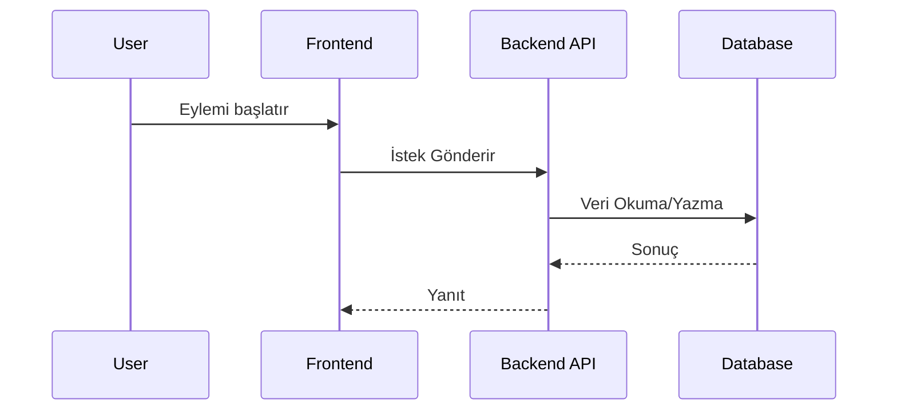
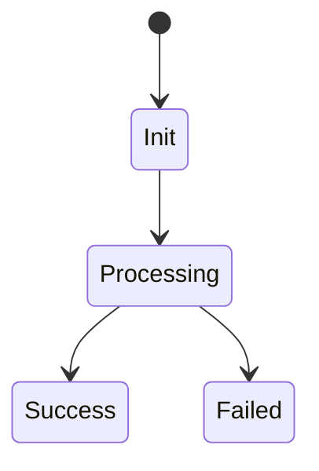

# Task [Numara]: [Görev Adı]

> **AI AGENT İÇİN ZORUNLU BİLDİRİM (MANDATORY INSTRUCTION):** 
> Bu taskı kodlamadan veya üzerinde herhangi bir mimari karar vermeden önce **KESİNLİKLE `f:\Projeler\CKN.Finance\.agents\rules\governance.md`** dosyasını oku ve kurallarına **HARFİYEN** uy. Tüm kodlama sürecinde "Zero-Warning Policy" ve "Documentation-Driven Development" prensipleri geçerlidir. Uç senaryolar, test edilebilirlik ve XML dokümantasyon kurallarını ihlal edemezsin. Değişiklikleri dökümante etmeyi unutma! Ayrıca her task en az 15KB büyüklüğünde olmalıdır. Aşağıda templatei görebilirsin.
> **Ek Kural:** Eğer `CKN.Sdk.*` paketlerinden birini kullanacaksan, ilgili paketin dokümantasyonunu bulmak için mutlaka `f:\Projeler\CKN.Finance\governance\docs\ckn.sdk\index.md` fihrist dosyasını incele.

## 1. 🎯 Görev Amacı ve Kapsam
[Bu görevin ne olduğu, sistemin hangi parçasını etkilediği ve neden yapıldığı detaylıca (en az 2 paragraf) açıklanmalıdır.]

## 2. 🔗 Çapraz Özellik Etkileşimleri (Cross-Feature Impacts)
[Bu geliştirmenin sistemdeki diğer modüllere, UI sayfalarına, arka plan işlemlerine veya dış servislere (Third-party) olan etkileri listelenmelidir.]
- **Etkilenen Backend Servisleri:** 
- **Etkilenen Frontend Modülleri:** 
- **Diğer Tasklara Bağımlılıklar:** 

## 3. 🛠 Teknik Gereksinimler ve Altyapı
[Görevin gerçekleştirilmesi için gerekli teknik adımlar, kurallar, validasyonlar.]

### 3.1. Veritabanı Değişiklikleri (DB Schema Changes)
[Eğer tablo eklenecekse veya değiştirilecekse, EntityFramework sınıfları ve özellikleri (Property'leri) burada tanımlanmalıdır.]

### 3.2. SDK ve Dış Kütüphane İhtiyaçları
[Eğer CKN.Sdk.* paketlerine yeni bir ekleme veya varolan bir arayüz (Interface) kullanımı gerekiyorsa burada detaylandırılmalıdır. Paket versiyonları veya yeni eklenecek kütüphaneler de burada belirtilmelidir.]

## 4. 🧩 Bileşen Ayrışımı ve Mimari (Component Breakdown)

### 4.1. Sequence / Akış Diyagramı

[Yukarıdaki diyagramı, bu göreve özel olarak baştan sona tasarlayın.]

### 4.2. State / Durum Diyagramı

[Eğer bir süreç yönetimi varsa (örn: Ödeme durumu, Sipariş statüsü) tasarlayın.]

### 4.3. API Sözleşmeleri (API Contracts)
**Request (CQRS Command / Query)**
```json
{
  "alan": "veri"
}
```

**Response (DTO)**
```json
{
  "sonuc": "basarili"
}
```

## 5. ⚠️ Uç Senaryolar ve Hata Yönetimi (Edge Cases & Error Handling)
| Hata Senaryosu | Olası Neden | Uygulanacak Sistem Yanıtı |
| --- | --- | --- |
| Veritabanı Timeout | Ağ gecikmesi | Global Exception Handler ile RFC 7807 (503 Service Unavailable) dönülecek |
| Geçersiz Veri Modeli | Client Validation Hatası | FluentValidation devreye girecek, HTTP 400 dönecek |

## 6. 🔄 Geri Alma ve Kurtarma Planı (Rollback Plan)
[Eğer bu task prod ortamını bozarsa veya veri tutarsızlığı yaratırsa, nasıl geriye dönüleceği adım adım açıklanmalıdır. (Örn: Veritabanı migration DOWN komutları, özellik bayrağını (Feature Flag) kapama vb.)]
