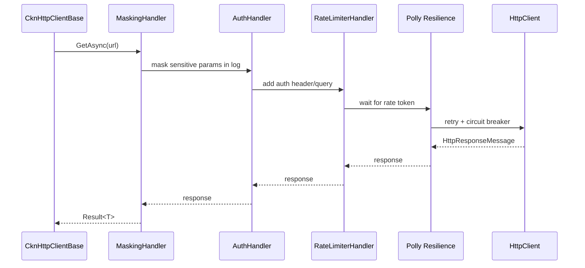

# Task 007: CKN.Sdk.Network + CKN.Sdk.Network.Http

> **AI AGENT ZORUNLU:** `.agents/rules.md` okundu, Zero-Warning Policy ve TDD uygulanacak.

## 1. 🎯 Görev Amacı ve Kapsam

Bu görev, CKN.SDK'ya provider-agnostic HTTP istemci altyapısı kazandırır. Finance projesindeki üç dış API sağlayıcısı (Yahoo Finance, Finnhub, Coinbase) şu an ham `HttpClient` ile yazılmış; her birinde elle yazılmış `Task.Delay` ile rate limiting, retry yok, loglarda API key sızma riski var.

`CKN.Sdk.Network` abstraction paketi `ICknHttpClient` arayüzünü ve tüm yapılandırma modellerini tanımlar. `CKN.Sdk.Network.Http` ise bu arayüzün `Microsoft.Extensions.Http.Resilience` tabanlı `HttpClient` implementasyonunu sağlar. Tüketici projeler provider bağımlılığına doğrudan referans vermeden `ICknHttpClient` üzerinden çalışır.

## 2. 🔗 Çapraz Özellik Etkileşimleri

- **CKN.Sdk.Core:** `Result<T>` ve `Error` tipleri kullanılıyor
- **CKN.Sdk.Tests:** Network/ alt klasörüne 6 test sınıfı ekleniyor
- **Finance'e Etki:** `AddHttpClient<T>()` kayıtları ve `Task.Delay` çağrıları kaldırılacak

## 3. 🛠 Teknik Gereksinimler

### 3.1. Yeni Paketler

**CKN.Sdk.Network:** Sıfır 3rd-party bağımlılık (Core proje referansı + Microsoft.Extensions.Logging.Abstractions).

**CKN.Sdk.Network.Http:** Microsoft.Extensions.Http.Resilience (zaten Directory.Packages.props'ta).

### 3.2. DI Kaydı Kalıbı

```csharp
// Program.cs
services.AddCknNetwork(net =>
    net.UseHttpClient()
       .AddCknHttpClient<YahooFinanceProvider>(opt =>
       {
           opt.BaseAddress = "https://query1.finance.yahoo.com/";
           opt.Timeout = TimeSpan.FromSeconds(15);
           opt.DefaultHeaders["User-Agent"] = "Mozilla/5.0";
           opt.RateLimit = new CknRateLimiterOptions { RequestsPerPeriod = 2, Period = TimeSpan.FromSeconds(1) };
       }));
```

## 4. 🧩 Bileşen Ayrışımı

### 4.1. Handler Pipeline Akışı



### 4.2. Sınıf Hiyerarşisi

```
ICknHttpClient (interface)
  └── CknHttpClientBase (abstract class, CKN.Sdk.Network.Http)
        └── YahooFinanceProvider (tüketici projede)
```

## 5. ⚠️ Uç Senaryolar

| Senaryo | Yanıt |
|---|---|
| 429 Too Many Requests | Polly `Retry-After` header'ına uyarak bekler |
| Network timeout | `Result.Failure(Error("HTTP_NETWORK", ...))`  |
| Null deserialization | `Result.Failure(Error.NullValue)` |
| Rate limiter doldu (QueueLimit) | `Result.Failure(Error("RATE_LIMIT_EXCEEDED", ...))` |
| Circuit breaker açık | `Result.Failure(Error("CIRCUIT_BREAKER_OPEN", ...))` |

## 6. 🔄 Geri Alma Planı

Paket NuGet'e yüklenmeden önce Finance'te test edilmeli. Sorun çıkarsa Finance `CKN.Sdk.Network` referansını kaldırıp eski `AddHttpClient<T>` kayıtlarına döner.
